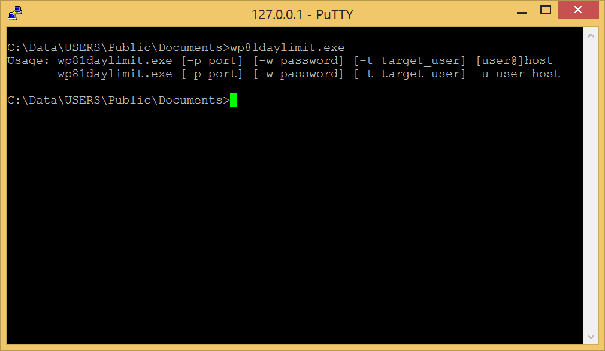

# wp81daylimit

A Windows Phone 8.1 console utility that enforces a **daily screen-time limit** on a remote Windows PC by connecting over SSH, detecting the logged-in user, and initiating a shutdown once the allowed connection time has been exceeded.



---

## Overview

`wp81daylimit` runs on a Windows Phone 8.1 device and communicates with a remote Windows machine via a hand-rolled SSH client (no libssh2 dependency). It:

1. Connects to the remote host over TCP and performs a full SSH handshake (banner exchange, key exchange, password authentication).
2. Opens an SSH channel and runs a PowerShell one-liner to enumerate logged-in users by inspecting running `explorer.exe` processes.
3. Checks whether a specific target user (`-t`) is currently logged in.
4. Queries a time-slot counter to determine how many 5-minute slots the user has been connected today.
5. If the cumulative connection time reaches or exceeds the configured limit, it logs a violation event and can trigger a remote shutdown.

All activity is recorded through **ETW (Event Tracing for Windows)** using a custom logger.

---

## Usage

```
wp81daylimit [-p port] [-w password] [-t target_user] [user@]host
wp81daylimit [-p port] [-w password] [-t target_user] -u user host
```

### Options

| Flag | Description |
|---|---|
| `-p <port>` | SSH port on the remote host (default: `22`) |
| `-u <user>` | SSH username (alternative to `user@host` syntax) |
| `-w <password>` | SSH password (if omitted, prompted interactively with echo disabled) |
| `-t <target_user>` | **Required.** Windows username to monitor on the remote machine |
| `[user@]host` | Remote host, with optional inline username |

### Examples

```
# Prompt for password, monitor user "alice" on 192.168.1.10
wp81daylimit -t alice alice@192.168.1.10

# Non-default SSH port, password on command line
wp81daylimit -p 2222 -w s3cr3t -t alice -u alice 192.168.1.10
```

---

## ETW Logging

The service registers an ETW provider with GUID:

```
{14cbde36-bfed-4c49-8319-db0679011d86}
```

Capture a real-time trace with [wp81debug](https://github.com/fredericGette/wp81debug):

```bat
wp81debug etw {14cbde36-bfed-4c49-8319-db0679011d86}
```

---

## Deployment

- [Install a telnet server on the phone](https://github.com/fredericGette/wp81documentation/tree/main/telnetOverUsb#readme), in order to run the application.  
- Manually copy the executable from the root of this GitHub repository to the shared folder of the phone.
> [!NOTE]
> When you connect your phone with a USB cable, this folder is visible in the Explorer of your computer. And in the phone, this folder is mounted in `C:\Data\USERS\Public\Documents`

